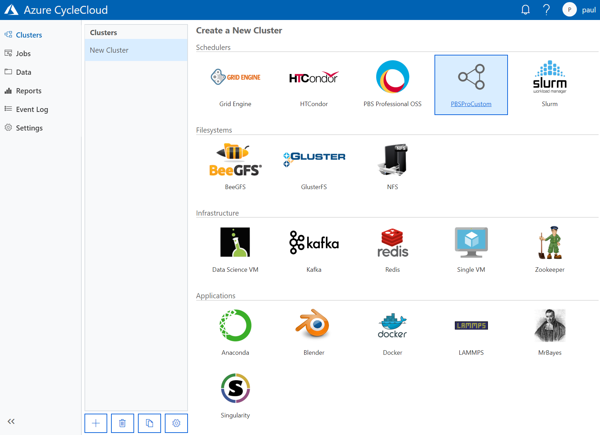
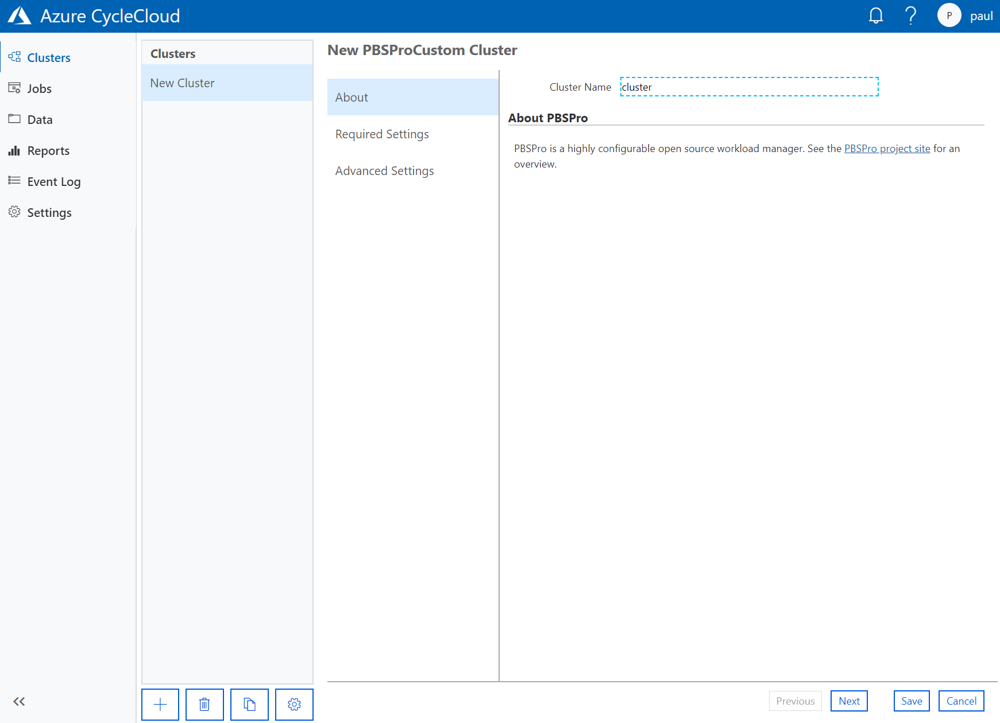
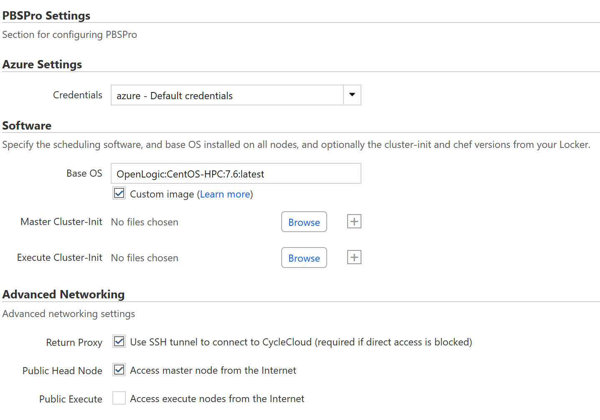
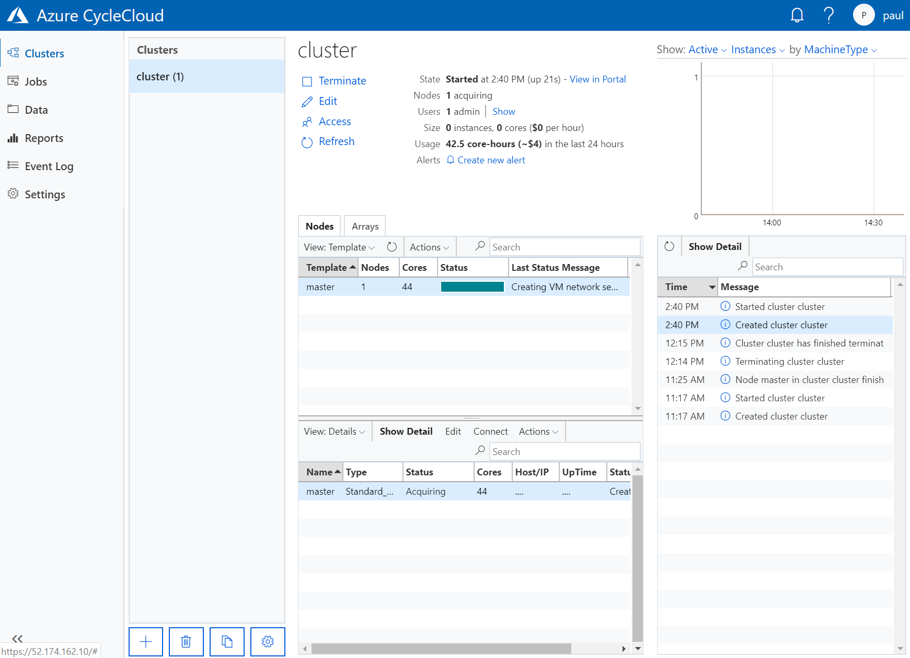

## Install and run Starccm+ Benchmarks using azurehpc cluster

## Prerequisites

These steps require a cluster with PBS.  The `simple_hpc_pbs` template in the examples directory a suitable choice.

## Installation

First copy the apps directory to the cluster.  The `azhpc-scp` can be used to do this:

```
azhpc-scp -r $azhpc_dir/apps hpcuser@headnode:.
```

### Install Prerequisites

The `libXt` package is required on the compute nodes.  This can be installed with the `add_reqs.sh` script that is provided (alternatively add to the install steps for the cluster you but with azurehpc).

```
azhpc-run -u hpcuser -n compute apps/starccm/scripts/add_reqs.sh 
```

### Install Starccm+

You must first obtain the starccm installer and copy it to the cluster.  If it is available on the local machine you can copy as follows:

```
azhpc-scp STAR-CCM+14.04.013_01_linux-x86_64-2.12_gnu7.1.zip /mnt/resource/.
```

The following environment variables can be used:

| Environment Variable  | Default Value | Description                                                                       |
|------------------------|--------------------------------------------------------------------|-----------------------------------------------------------------------------------------|
| APP_INSTALL_DIR        | /apps                                                              | The place to install (a starccm directory will be created here                      |
| TMP_DIR                | /mnt/resource | A temporary directory for installation files                                                                                                 |
| STARCCM_INSTALLER_FILE | /mnt/resource/STAR-CCM+14.04.013_01_linux-x86_64-2.12_gnu7.1.zip| The full path to the `STAR-CCM+14.04.013_01_linux-x86_64-2.12_gnu7.1.zip` installer |

This will run with the default values:

```
azhpc-run -u hpcuser apps/starccm/install_starccm.sh
```

Example running with non default values
```
azhpc-run -u hpcuser STARCCM_INSTALLER_FILE=/apps/tmp/STAR-CCM+14.04.013_01_linux-x86_64-2.12_gnu7.1.zip APP_INSTALL_DIR=/apps/CFD apps/starccm/install_starccm.sh
```

# Copy over the benchmark files

The benchmark will need to be copied to the cluster.  The default in the run script is `civil`.  You can copy the `sim` file as follows:

```
azhpc-run -u hpcuser -n headnode mkdir /data/starccm
azhpc-scp civil.sim hpcuser@headnode:/data/starccm/civil.sim
```

## Connect to the headnode

```
azhpc-connect -u hpcuser headnode
```

## Running Starccm+

The `run_case.pbs` script is ready to use.  Below are all the parameters although the only one that is required if you have followed the previous steps is the PoD key for StarCCM licensing:

| Environment Variable | Default Value | Description                                                                             |
|----------------------|---------------|-----------------------------------------------------------------------------------------|
| APP_INSTALL_DIR      | /apps         | The place to install (a starccm directory will be created here                          |
| DATA_DIR             | /data/starccm | The directory where the sim file is located (relative paths are based on PBS_O_WORKDIR) |
| CASE                 | civil         | The case to run (excluding path and `.sim` extension)                                   |
| PODKEY               |               | This is required for the licensing                                                      |

Environment variables can be passed to the PBS job with the `-v` flag.

Submit a job as follows (remembering to substitute your PoD key value):

    qsub -l select=2:ncpus=60:mpiprocs=60,place=scatter:excl \
        -v PODKEY=#INSERT_POD_KEY# \
        $HOME/apps/starccm/run_case.pbs

> Note: multiple environment variables can be set if they are separated by commas, e.g. `-v VAR1=x,VAR2=y`.

The output will be in the working directory for where it was submitted.

## Install and run Starccm+ Benchmarks using [Azure CycleCloud](https://docs.microsoft.com/en-us/azure/cyclecloud/) Cluster

## Prerequisites

These steps require a Azure CycleCloud cluster with PBS.  The `cyclecloud_simple_pbs` template in the examples directory a suitable choice. 
Note: Before creating the cluster with above template we need to update the default project spec to install the StarCCM dependency. Add the following in specs/default/cluster-init/scripts/01_install_packages.sh to have the following:

```
#!/bin/bash

yum -y install libXt
```
Follow the steps in the examples/cyclecloud_simple_pbs/readme.md to setup cycle and import the template.

### Starting the cluster

Now, go to the Azure CycleCloud web page and create a new cluster.



Fill in the name.



Set the node type to `Standard_HC44rs` in the required settings.  Choose your maximum number of cores and select the vnet you wish to use.


Set the Base OS to OpenLogic:CentOS-HPC:7.6:latest and select custom image in the Advanced Settings. 



Now save and start the cluster.



The web page will show progress as the headnode for the cluster starts.

Log in to the headnode of the cluster:

```
    $ cyclecloud connect master -c starccm
```

## Installing StarCCM

You will need to copy the /apps/starccm folder to the headnode. Now obtain the starccm installer and copy it to the cluster to /mnt/resource. 

The following environment variables can be used:

| Environment Variable  | Default Value | Description                                                                       |
|-----------------------|---------------|-----------------------------------------------------------------------------------|
| APP_INSTALL_DIR       | /apps         | The place to install (a starccm directory will be created here                    |
| TMP_DIR               | /mnt/resource | A temporary directory for installation files                                      |
| STARCCM_INSTALLER_FILE | /mnt/resource/STAR-CCM+14.04.013_01_linux-x86_64-2.12_gnu7.1.zip| The full path to the `STAR-CCM+14.04.013_01_linux-x86_64-2.12_gnu7.1.zip` installer |

This will run with the default values:

Run the following to install StarCCM+ on the cluster:

```
apps/starccm/install_starccm.sh
```

## Running StarCCM

The benchmark will need to be copied to the cluster.  The default in the run script is `civil`.  You can copy the `sim` file to the headnode.

The `run_case.pbs` script is ready to use.  Below are all the parameters although the only one that is required if you have followed the previous steps is the PoD key for StarCCM licensing:

| Environment Variable | Default Value | Description                                                                             |
|----------------------|---------------|-----------------------------------------------------------------------------------------|
| APP_INSTALL_DIR      | /apps         | The place to install (a starccm directory will be created here                          |
| DATA_DIR             | /data/starccm | The directory where the sim file is located (relative paths are based on PBS_O_WORKDIR) |
| CASE                 | civil         | The case to run (excluding path and `.sim` extension)                                   |
| PODKEY               |               | This is required for the licensing                                                      |

Environment variables can be passed to the PBS job with the `-v` flag.

Submit a job as follows (remembering to substitute your PoD key value):

    qsub -l select=2:ncpus=60:mpiprocs=60,place=scatter:excl \
        -v PODKEY=#INSERT_POD_KEY# \
        $HOME/apps/starccm/run_case.pbs

> Note: multiple environment variables can be set if they are separated by commas, e.g. `-v VAR1=x,VAR2=y`.

The output will be in the working directory for where it was submitted.
